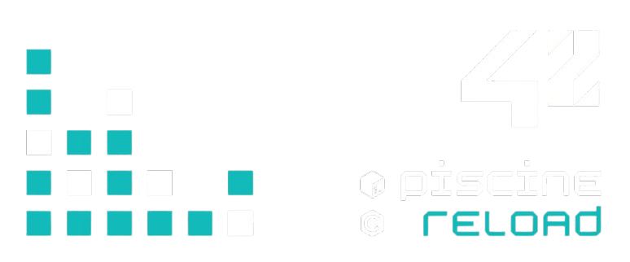

#  • 42 Piscine Reload 

### Overview
The Piscine Reload program focuses on mastering the fundamentals of C programming, including memory management, data structures, and algorithmic problem-solving. 
 Throughout this project, I have implemented various functions and utilities that adhere to the strict coding standards set by the 42 school.
Features

C Functions: Implementation of core C functions such as ft_strlen, ft_strchr, ft_memchr, and more. 
Memory Management: Techniques for dynamic memory allocation and manipulation.  
Coding Standards: All code is written following the Norm established by 42, ensuring readability, maintainability, and efficiency.

### Earned skills

  

  

###### Projeto desenvolvido por: [Adão Gonçalves](https://github.com/AdaoG0n)

